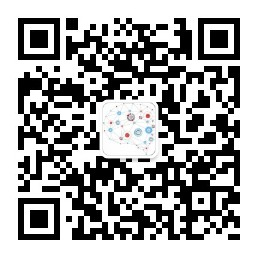

# 1 简介
 [《ASP.NET Core开发者指南路线图》](https://github.com/MoienTajik/AspNetCore-Developer-Roadmap/blob/master/ReadMe.zh-Hans.md)给我们广大ASP.NET Core开发者的学习指明了方向，根据路线图我个人在学习过程中的整理了一些读书笔记、学习心得等文章资料，希望与大家共同进步。

文章中使用的代码我们都放在：https://github.com/zcqiand/aspnetcore-guide

# 2 目录
*[·-·]:## 2.1 通用开发技能
## 2.2 C#
1. [委托，事件和Lambda表达式](https://www.cnblogs.com/zcqiand/p/13656161.html)
2. [异步编程（或多线程编程）)](https://www.cnblogs.com/zcqiand/p/13650062.html)

## 2.3 ASP.NET Core 基础知识
1. [Asp.Net Core WebApi入门](https://www.cnblogs.com/zcqiand/p/14258066.html)

*[·-·]:## 2.4 SQL 基础知识
*[·-·]:## 2.5 SOLID
## 2.6 设计模式
1. [什么是观察者模式](https://www.cnblogs.com/zcqiand/p/14257614.html)
2. [什么是中介者模式](https://www.cnblogs.com/zcqiand/p/14257644.html)

## 2.7 依赖注入
1. [什么是依赖注入](https://www.cnblogs.com/zcqiand/p/14257641.html)
2. [Microsoft.Extensions.DependencyInjection入门](https://www.cnblogs.com/zcqiand/p/14257661.html)
3. [Autofac入门](https://www.cnblogs.com/zcqiand/p/14257650.html)

*[·-·]:## 2.8 对象映射
## 2.9 API
1. [如何使用Swagger](https://www.cnblogs.com/zcqiand/p/14258075.html)

*[·-·]:## 2.10 数据库
## 2.11 ORM
## 2.11.1 Entity Framework Core
1. [Entity Framework Core增删改查（CRUD）](https://www.cnblogs.com/zcqiand/p/14258059.html)

## 2.12 缓存
1. [如何使用内存缓存（IMemoryCache）](https://www.cnblogs.com/zcqiand/p/14257594.html)
2. [如何使用分布式缓存（Redis）](https://www.cnblogs.com/zcqiand/p/14257582.html)

## 2.13 日志
1. [如何使用日志(Serilog)](https://www.cnblogs.com/zcqiand/p/14257598.html)

*[·-·]:## 2.14 任务调度
*[·-·]:## 2.15 实时通信
## 2.16 微服务
### 2.16.1 消息队列
1. [RabbitMQ入门](https://www.cnblogs.com/zcqiand/p/14257673.html)

### 2.16.2 消息（事件）总线
1. [什么是事件总线](https://www.cnblogs.com/zcqiand/p/14257623.html)
2. [如何使用RabbitMQ实现事件总线](https://www.cnblogs.com/zcqiand/p/14257607.html)
3. [MassTransit入门](https://www.cnblogs.com/zcqiand/p/14257654.html)

## 2.17 DDD（领域驱动设计）
1. [什么是DDD](https://www.cnblogs.com/zcqiand/p/13686640.html)

## 2.18 其他
1. [MediatR入门](https://www.cnblogs.com/zcqiand/p/14257683.html)

## 联系我
* 微信公众号：南荣相如谈编程
* 头条号：[南荣相如谈编程](http://www.toutiao.com/c/user/102425115737/)
* 网站：https://www.aidaibi.net
* 邮箱：1282301776@qq.com
* Github: https://github.com/zcqiand
* 知乎：https://www.zhihu.com/people/zcqiand
* 博客: https://www.cnblogs.com/zcqiand/

## 捐赠支持
项目的发展离不开你的支持，如果觉得我们的内容对于你有所帮助，请作者喝杯咖啡吧！ 后续会继续完善更新！一起加油！

## 微信公众号
如果大家想要实时关注我更新的文章以及分享的干货的话，可以关注我的公众号。

